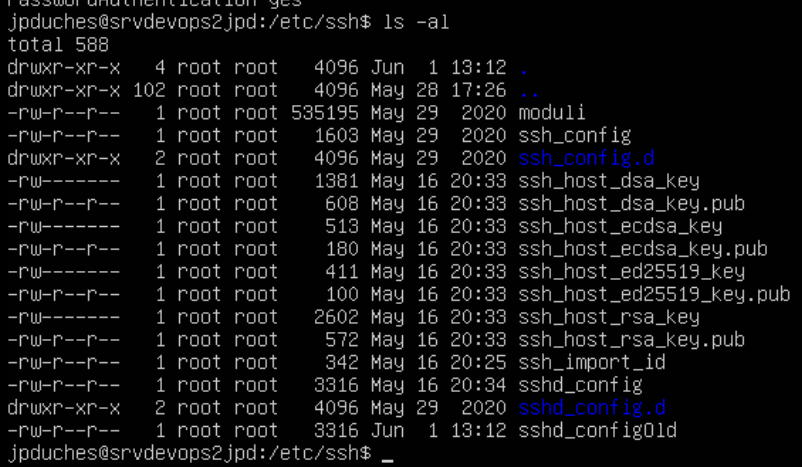

# Exercice 5 - Accès distant avec SSH


- Évaluation : formative
- Durée estimée : 2 heures
- Système d'exploitation : Ubuntu Client et serveur


**Objectifs :**

- Utiliser des clés privées et publiques
- Gérer un serveur à distance
- Sécuriser l'accès SSH


## Utilisation de votre clé SSH sur GitHub


- Connectez-vous votre station de travail Ubuntu.
- Prenez la clé publique générée lors de l'exercice 1 et publiez-la sur votre compte GitHub. Bien sûr, si vous n'avez pas de compte créez-en un. Vous pouvez-vous aidé du livre Pro Git page 163. Ce livre est  disponible sur Léa.
- Rendez-vous sur mon dépôt à l'adresse [https://github.com/jpduchesneauCegep/ITV_Exercice5](https://github.com/jpduchesneauCegep/ITV_Exercice5)
- Faite un Fork de mon dépôt. Voir dans le coin droit cet outil :


**Question**: Qu'est-ce qu'un "fork" en Git?
<details>

> Les utilisateurs qui n’ont pas la permission de pousser sur un dépôt peuvent en faire un fork (créer leur propre copie), pousser des commits sur cette copie et ouvrir une requête de tirage (Pull Request)
depuis leur fork vers le projet principal. Ce modèle permet au propriétaire de garder le contrôle total sur ce qui entre dans le dépôt et quand, tout en autorisant les contributions des utilisateurs non fiables.
Source : Pro Git

</details>

--

- Récupérer votre fork don mon dépôt par la commande git clone nom de votre copie sur votre poste de travail.
- Modifier le fichier README.md en y ajoutant votre nom dans la liste des contributeurs.
- Pousser votre modification sur votre dépôt sur Git Hub avec la commande push. Si vous avez bien inséré votre clé SSH sur GitHub, vous ne devriez pas avoir besoin de vous authentifier.
- Sur votre page de GitHub, faites une demande de Pull Request pour que j'accepte de modifier le dépôt principal de votre contribution. Soyez gentil, écrivez un message avec votre demande.  Si non, peut-être que je n’accepterais pas votre demande.;-)

Pour vous aidez : [https://git-scm.com/book/fr/v2/GitHub-Contribution-%C3%A0-un-projet]

Votre clé SSH pourra être utilisée toute la session entre votre poste client et votre compte GitHub.

## Création d'un fichier de configuration personnel pour SSH
Lorsque vous installez SSH, un répertoire ~/.ssh est créé automatiquement. Ce répertoire contient votre clé publique, votre clé privée et un fichier known_hosts. Votre configuration est également stockée ici.
Au moins sur Ubuntu, le fichier de configuration SSH n'est pas créé par défaut. Vous pouvez facilement créer ce fichier en utilisant la commande touch comme ceci :
```bash
$touch ~/.ssh/config
```


**Ajouter un profil SSH dans le fichier de configuration**
Ce fichier va vous permettre de garder les informations de connexions sur les différentes machines sur lesquels vous devez vous connecter par SSH.


Disons que vous vous connectez à un serveur dont l'IP est 10.100.2.50. Votre nom d'utilisateur est jpduches et le serveur est utilisé pour héberger votre site Web. Pour renforcer la sécurité de SSH, vous utilisez le port 1500 au lieu du port SSH 22 par défaut.
Vous pouvez ajouter toutes ces informations de la manière suivante dans votre fichier ~/.ssh/config

>**[!Attention]** Attention il s'agit d'un exemple. Si vous voulez le tester, utilisé votre nom d'Usager, l'adresse IP de votre serveur et le port 22 puisqu'il n'a pas été modifié. 
```bash
Host website
        Hostname 10.100.2.50
        User jpduches
        port 1500
```     
- Il suffit de sauvegarder les informations dans le fichier. Il n'est pas nécessaire de redémarrer un service.
- Maintenant, au lieu d'écrire une longue commande comme celle-ci :


```bash
ssh jpduches@10.100.2.50 -p 1500
``` 


- Vous pouvez simplement utiliser cette commande (la complétion par tabulation fonctionne également) :


```bash
ssh website
``` 
Vous ajouter autant de Hosts que vous en avez besoin.


Vous pouvez toujours vous référer à la page de manuel de ssh_config pour en savoir plus sur les paramètres que vous pouvez utiliser lors de la création de votre fichier de configuration SSH.

## Sécuriser l'accès SSH du serveur de test

>**[!Attention]** les commandes suivantes doivent être exécutées avec l'élévation des privilèges entant que SUDO.

Les fichiers de configuration de SSH sont situés dans /etc/ssh/. Comme tous fichier de configuration qu'on modifie, il est nécessaire de les sauvegarder avant de les modifier. 

- Utilisez la technique suivante sur tous les fichiers de configuration que vous modifiez. Si j'aimais, il y a un problème, il est facile de revenir en arrière.

```bash
sudo cp /etc/ssh/sshd_config /etc/ssh/sshd_configOld 
#au besoin récupérer votre fichier ainsi : 
sudo cp /etc/ssh/sshd_configOld /etc/ssh/sshd_config
``` 




## 10 Techniques pour sécuriser votre serveur SSH :


**1- Désactiver les mots de passe vides :**


Oui, il est possible d'avoir des comptes utilisateurs sous Linux sans aucun mot de passe. Si ces utilisateurs essaient d'utiliser SSH, ils n'auront pas besoin de mots de passe pour accéder au serveur via SSH également.


C'est un risque pour la sécurité. Vous devriez interdire l'utilisation de mots de passe vides. Dans le fichier /etc/ssh/sshd_config, veillez à définir l'option PermitEmptyPasswords sur no.


***PermitEmptyPasswords no***


**2- Changer le port SSH** 


Si vous connaissez les bases de SSH, vous savez déjà que SSH utilise le port 22 par défaut.


Lorsque vous vous connectez à un serveur via SSH, la plupart du temps, vous ne fournissez aucune information sur le port. Dans ce cas, votre connexion est dirigée vers le port 22 du serveur SSH.


Vous pouvez modifier le port par défaut de 22 à un numéro de port de votre choix en suivant les étapes suivantes :
- Localisez la ligne qui contient le port 22 (si elle est commentée par #, supprimez également le #).
- Changez la ligne en Port 2522 (ou tout autre nombre de votre choix entre 1024 et 65535).
- Assurez-vous que le nouveau port est autorisé par les pare-feu (si vous en avez).
- Redémarrez le démon ssh avec sudo systemctl restart sshd.


À partir de maintenant, vous devrez spécifier le port pour établir la connexion ssh ou utiliser votre fichier de configuration.


**3- Désactiver la connexion root via SSH**


L'utilisation du serveur en tant que root lui-même devrait être interdite. C'est risqué et cela ne laisse aucune trace d'audit. Des mécanismes comme sudo existent uniquement pour cette raison.


Si vous avez ajouté des utilisateurs sudo sur votre système, vous devez utiliser cet utilisateur sudo pour accéder au serveur via SSH au lieu de root.


- Désactiver la connexion de root en modifiant l'option PermitRootLogin et en lui attribuant la valeur no :


***PermitRootLogin no***


**4- Configurer le délai d'inactivité**


L'intervalle de délai d'inactivité est la durée pendant laquelle une connexion SSH peut rester active sans aucune activité. Ces sessions inactives constituent également un risque pour la sécurité. C'est une bonne idée de configurer le délai d'inactivité.


Le délai d'attente est exprimé en secondes et par défaut il est de 0. Vous pouvez le changer en 300 pour conserver un délai d'attente de cinq minutes.
***ClientAliveInterval 300***


Après cet intervalle, le serveur SSH enverra un message de vie au client. S'il ne reçoit pas de réponse, la connexion sera fermée et l'utilisateur final sera déconnecté.


Vous pouvez également contrôler le nombre de fois qu'il envoie le message de vie avant de se déconnecter :
***ClientAliveCountMax 2***


**5- Autorisez l'accès SSH à des utilisateurs sélectionnés uniquement***


En matière de sécurité, vous devez suivre le principe du moindre privilège. Ne donnez pas de droits lorsque cela n'est pas nécessaire.
Vous avez probablement plusieurs utilisateurs sur votre système Linux. Devez-vous autoriser l'accès SSH à chacun d'entre eux ? Peut-être pas.
Une approche dans ce cas serait d'autoriser l'accès SSH à quelques utilisateurs sélectionnés et de le restreindre pour tous les autres utilisateurs.


***AllowUsers User1 User2***


Vous pouvez également ajouter des utilisateurs sélectionnés à un nouveau groupe et autoriser uniquement ce groupe à accéder à SSH.


***AllowGroups ssh_group***


Vous pouvez également utiliser les options DenyUsers et DenyGroups pour refuser l'accès à SSH à certains utilisateurs et groupes.


**6- Atténuer automatiquement les attaques par force brute**


Pour contrecarrer les attaques SSH par force brute, vous pouvez utiliser un outil de sécurité comme Fail2Ban.
Fail2Ban vérifie les tentatives de connexion échouées à partir de différentes adresses IP. Si ces mauvaises tentatives franchissent un seuil dans un intervalle de temps donné, il interdit à l'IP d'accéder à SSH pendant une certaine période.


Vous pouvez configurer tous ces paramètres en fonction de vos préférences et de vos besoins. Il y a un guide d'introduction détaillé sur l'utilisation de Fail2Ban que vous pouvez lire.


https://linuxhandbook.com/fail2ban-basic/


**7- Désactiver la connexion SSH basée sur un mot de passe**


Quels que soient vos efforts, vous verrez toujours de mauvaises tentatives de connexion via SSH sur votre serveur Linux. Les attaquants sont intelligents et les scripts qu'ils utilisent prennent souvent en charge les paramètres par défaut des outils de type Fail2Ban.


Pour vous débarrasser de ces attaques constantes par force brute, vous pouvez opter pour une connexion SSH basée uniquement sur une clé.


Dans cette approche, vous ajoutez la clé publique des systèmes clients distants à la liste des clés connues sur le serveur SSH. De cette façon, ces machines clientes peuvent accéder à SSH sans saisir le mot de passe du compte utilisateur.


Lorsque vous avez cette configuration, vous pouvez désactiver la connexion SSH basée sur le mot de passe. 


Désormais, seules les machines clientes qui possèdent les clés SSH spécifiées peuvent accéder au serveur via SSH.


**Attention :**
Avant d'opter pour cette approche, assurez-vous que vous avez ajouté votre propre clé publique au serveur et qu'elle fonctionne. Sinon, vous vous bloquerez et vous risquez de perdre l'accès au serveur distant, surtout si vous utilisez un serveur en nuage où vous n'avez pas d'accès physique au serveur.


Avant de le faire, vous devez garder à l'esprit les points suivants :


- Veillez à créer votre paire de clés ssh sur votre ordinateur personnel/professionnel et ajoutez cette clé SSH publique au serveur afin que vous puissiez au moins vous connecter au serveur.
- La désactivation de l'authentification par mot de passe signifie que vous ne pouvez pas vous connecter à votre serveur à partir d'ordinateurs aléatoires.
-    Vous ne devez pas perdre vos clés ssh. Si vous formatez votre ordinateur personnel et perdez les clés ssh, vous ne pourrez jamais accéder au serveur.
- Si vous êtes verrouillé, vous ne pourrez jamais accéder à votre serveur.


**Comment procéder:**

**Copier votre clé SSH sur votre serveur de test**

- Créer le dossier .ssh dans votre usager sur le serveur et créer le fichier authorized_keys dans le dossier

- Par la suite, sur votre client à l'aide de la commande scp copiez votre clé SSH sur votre serveur :

```bash
ssh-copy-id {votreusager}@{adresse IP du serveur}
# Entrer le mot de passe de l'usager.
```
- Vous pouvez par la suite vous connecter au serveur : 


- Éditez le fichier /etc/ssh/sshd_config
    - Trouvez la ligne **Password Authentication Yes**
    - Changer la pour **Password Authentication no**
    - S'il y a un # (signifie commenté) au début de cette ligne, supprimez-le.
    - PubKeyAuthentification yes
    - Décommenté AuthorizedKeysFile
 - Sauvegardez le fichier après avoir effectué ces modifications et redémarrez le service SSH en utilisant cette commande :

```bash
systemctl restart ssh
``` 

- Testez la connexion depuis votre client vers votre serveur

**8- Allez plus loin avec l'authentification à deux facteurs avec SSH**


Pour faire passer la sécurité SSH au niveau supérieur, vous pouvez également activer l'authentification à deux facteurs. Dans cette approche, vous recevez un mot de passe à usage unique sur votre téléphone portable, par courriel ou par le biais d'une application d'authentification tierce.
Vous trouverez ici des informations sur la configuration de l'authentification à deux facteurs avec SSH.


https://www.linode.com/docs/guides/use-one-time-passwords-for-two-factor-authentication-with-ssh-on-ubuntu-16-04-and-debian-8/


***9- Désactiver le transfert X11***


Le X11 ou le serveur d'affichage X est le cadre de base d'un environnement graphique. La redirection X11 vous permet d'utiliser une application GUI via SSH.
En principe, le client exécute l'application GUI sur le serveur, mais grâce à la redirection X11, un canal est ouvert entre les machines et les applications GUI sont affichées sur la machine cliente.
Le protocole X11 n'est pas axé sur la sécurité. Si vous n'en avez pas besoin, vous devriez désactiver la redirection X11 dans SSH.


***X11Forwarding no***


**10- Désactiver le protocole ssh 1**


Si vous utilisez une ancienne distribution Linux. Certaines versions plus anciennes de SSH peuvent encore avoir le protocole SSH 1 disponible. Ce protocole présente des vulnérabilités connues et ne doit pas être utilisé.


Les versions plus récentes de SSH ont automatiquement activé le protocole 2, mais il n'y a pas de mal à le vérifier.


# Remise

- Faite une capture d'une connexion ssh à partir du fichier de configuration qui permet de vous connecter à votre serveur disant sous le nom de website.

```bash
ssh website
``` 
Je dois pouvoir voir la commande et le résultat de connexion sur votre serveur.
Déposer la capture sur LÉA comme preuve de réalisation de l'exercice 5.
### Lecture complémentaire :

Plusieurs parties de cet exercice proviennent du site Web https://linuxhandbook.com/
