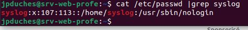

# Exercice 7  - Administration système

- Évaluation : formative
- Durée estimée : 2 heures
- Système d'exploitation : Ubuntu Client et serveur
- Aucune remise mais très important.

**Objectifs :**
Gestion appropriée desprocessus, de la mémoire et de l’espace disque.
- Localiser l'emplacement et la taille du noyau (kernel) Linux
- Localiser les modules associés au noyau de Linux
- Vérifier les modules chargés en mémoire
- Localiser les fichiers sources de Linux
- Utiliser des commandes d'administration système

## Environnement Linux

- Connectez-vous à votre serveur depuis votre station de travail.
- Indiquez la version de votre noyau :

```bash
cat /proc/version 
# Ou 
uname -r
```
- Localisez le  noyau Linux et donnez sa taille :

```bash
cd /boot
```
- Dans ce répertoire, le noyau compressé et binaire Linux commence avec le mot vmlinuz-*version*.
- Regardez son nom complet et sa taille :

```bash
ls -lh
```
- À partir des liens symboliques, essayez de déterminer qu'elle est la version utilisée.

- Pour voir les modules qui peuvent être associés au noyau : 
```bash
cat /proc/modules | less
```
- Ce sont tous les modules actifs avec le kernel.
- Tapez la commande :
```bash
lsmod |less
```
- Faite man lsmod, y a t'il un manuel pour cette commande ? Non
- Cherchez sur le Web pour trouver des informations.
- On vous proposera aussi de lire sur modprobe et modinfo.
- Essayer la commande suivante: 
```bash
modinfo cryptd
```
- Vous voyez un module qui est responsable de cryptographies asynchrones.
- En y regardant de plus près, voyez-vous un module nommé ip_qtable (firewall Linux) ?
- Taper maintenant la commande :
```bash
sudo iptables -vnL 
```
- Cette commande affiche les règles du pare-feu par défaut. Actuellement il n'y a aucune règle de pare-feu sur votre serveur.
- Taper la commande 
```bash
lsmod|grep iptable
```
[Pour en savoir un peu plus sur iptable](https://www.linuxtricks.fr/wiki/iptables-quelques-trucs-utiles)
- Vous pouvez refaire l'ensemble de la partie précédente sur votre poste client. Pour voir s’il y a des différences.


## Commandes d'administration  système


### Les disques 
- Vous connaissez déjà la commande :
```bash
df -h
```
- Essayons maintenant 
```bash
sudo fdisk -l | less
```
- Essayons maintenant les commandes pour voir les partitions LVM: 
```bash
sudo pvdisplay
sudo vgdisplay
sudo lvdisplay
```
- Afficher le contenu du fichier /etc/fstab


```bash
sudo cat /etc/fstab
```
**Question** : Quel est l'utilité du fichier /etc/fstab ?
- Essayez man fstab


<details>
Le fichier fstab (file systems table) est la table des différents systèmes de fichiers sur un ordinateur sous Unix/Linux : il contient une liste des disques utilisés au démarrage et des partitions de ces disques. Pour chaque partition, il indique comment elle sera utilisée et intégrée à l’arborescence du système de fichiers global (c'est-à-dire le point de montage).
</details>

### Gestion des processus


- Tapez la commande 
```bash
ps 
```
- Vous voyez les processus appartenant à votre usager.
- Ajouter les paramètres suivants : 
```bash
ps aux
```
- Vous voyez maintenant l'ensemble des processus de votre système. Remarquer la dernière ligne, elle représente la commande que vous venez d'exécuter  qui est elle aussi un processus.


- Tapez la commande :
```bash
ps -ef
```


**Question** : Indiquer  quel est le processus qui est au tout début et qui est considéré comme le père de tous les processus


<details>

```bash
UID      PID     PPID 

root      1        0
```

</details>


- Tapez la commande :
```bash
$ps aux |grep syslog
```
- Vous devriez voir deux processus : 
    - Le premier est le processus syslog (/usr/sbin/rsyslogd)
    - le deuxième est votre commande ps aux avec le grep


**Question** : qui est le propriétaire du processus rsyslogd ?
<details>
syslog
</details>


**Question** : trouvez le numéro de l'usager qui est propriétaire du  processus  ?


<details>

cat /etc/passwd |grep syslog



</details>


**Question** est-ce que cet usager à accès au Shell ?
<details>

non 

syslog:x:107:113::/home/syslog:/usr/sbin/nologin

</details>


**Question** est-ce que cet usager est membre d'un groupe ?
<details>
oui de 2 groupes.(adm et syslog)
cat /etc/group |grep syslog
</details>

<hr>

**Sur votre poste client :**
- tapez la commande top


```bash
top
```
- Remarquez les informations suivantes : le nombre total de tâches affichées, l'utilisation du CPU, la mémoire vive et la partition d'échange SWAP.
- Laissez la commande top et ouvrez le navigateur Firefox
- Ttaper les commandes suivantes : 

```bash
pidof firefox
# Vous devriez avoir plusieur processus.pki
kill $(pidof firefox)

# Firefox c'est fermé
```

## La recherche de fichiers


- Taper la commande :


```bash
cd
```


**Question**  : Dans quel répertoire vous ramène cette commande  ? 


<details>
- utiliser pwd pour trouver

- Vouz devez être dans votre répertoire d'usager

Remarque : votre répertoire personnel par défaut est indiqué par le tilde dans l’invite de commandes.
</details>

***Attention***: Au besoin installer la commande ***plocate***.
```bash
sudo apt install plocate
```
- Taper la commande :
```bash
touch toto
#suivie de :
locate toto
```

**Question** : Est-ce que votre fichier nouvellement créé a été trouvé ?

<details>
Non vous ne trouver pas le fichier. Car locate, cherche dans une base de données. Si celle-ci n'a pas été mie à jour. Vous ne pouvez pas trouver les informations.
Pour mettre à jour la base de données sur lequel se fie l'index utilisé par la commande locate, il faut utiliser la commande **sudo updatedb** (régulièrement).
</details>


- Taper la commande sudo updatedb et refaire ensuite la commande locate toto vous devriez maintenant trouver le fichier toto.

- Taper maintenant la commande :


```bash
touch toto2
#suivie de :
locate toto2 # Rien la bd n'est pas mise à jour.

# allons-y plutôt avec find :
find . -name toto2

```
**Question** : Est-ce que le fichier nouvellement créé a été trouvé ?
<details>
Oui

find, cherche dans le système de fichier. La commande n'a pas besoin d'index. La command est un outil puissant qui permet aux administrateurs système de localiser et de gérer des fichiers et des répertoires en fonction d'un large éventail de critères de recherche. Il peut trouver des répertoires et des fichiers par leur nom, leur type ou leur extension, leur taille, leurs autorisations, etc.
Son apprentissage vous fera gagner beaucoup de temps.


La syntaxe générale de la commande find est :
```bash


find {path} {name -of-file or dir-to-search} {action-to-take}
```
- path : spécifie le répertoire de recherche
- name -of-file or dir-to-search :Nom du fichier ou du répertoire à rechercher
- action-to-take : comme copier, supprimer, déplacer, etc.
</details>


- Taper maintenant la commande :


```bash
find / -name toto2
```
**Question** : pourquoi avez-vous un message d'erreur ?

<details>
Vous faites une recherche sur la racine (/) donc dans des répertoires ou vous n'avez pas de droit de lecture.

Changez la commande en ajoutant sudo devant et ça vas fonctionner. Mais le temps de réponse est un peu long, car vous lui avez demandé de chercher dans toutes l'arborescence de fichier (/) et non seulement dans l'emplacement courante (.).
</details>

- Taper maintenant la commande :


```bash
which find
#suivi de :
man which
```

<hr>

## Vérifier votre configuration réseau

**Sur votre serveur :**

Pour vérifier la configuration de votre réseau :


- D'abord vérification des interfaces
```bash
ip a
#et en suite :
ifconfig
# au besoins :
sudo apt install net-tools
# et à nouveau : 
ifconfig
```


- La passerelle doit être vérifiée pour savoir si on peut sortir du réseau local 
```bash
route -n 
#ou
netstat -nr
# Vérifier la réponse de la passerelle par un ping 
ping {Adresse IP passerelle}
# Probablement l'adresse IPv4 : 10.100.2.1
```

- Par la suite, nous voulons savoir si la résolution de nom fonctionne : 
```bash
# Résolution de nom au niveau local :
cat /etc/hosts
ping localhost # Ping sur la boucle local
ctrl-c # Pour arrêter les  ping
ping [nomMachine] # C'Est le même que celui qui suit votre @ dans votre invité de commande (prompt.
ctrl-c # Pour arrêter les  ping

# Résolution de nom au niveau des serveurs DNS

resolvectl status 
```
- Vérifier si vous atteigniez les serveurs DNS : 

```bash
ping {Adresse IP DNS}
```
- Au final ou au début ;-)
- Ping sur un FQDN (Full qualified domain name)
```bash
ping {domaine de votre choix}
```
- Si tous fonctionnent, vous êtes satisfait ;-) 

Vous avez une connectivité avec Internet.

**Fin exercice **


### Lecture complémentaire :

[Tutoriel pour comprendre et changer de noyaux Linux avec Ubuntu 20.04 LTS](https://lafibre.info/serveur-linux/noyaux-linux/)
