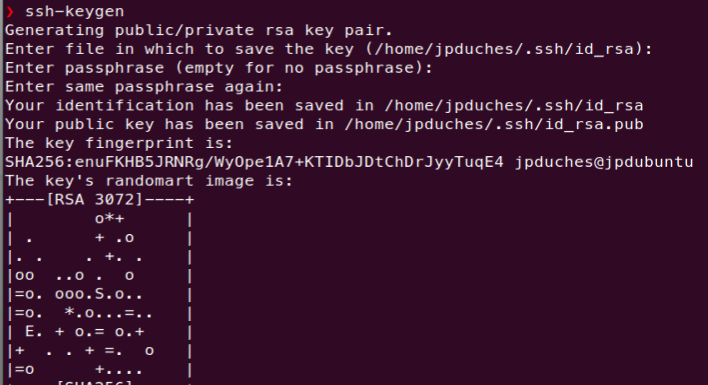
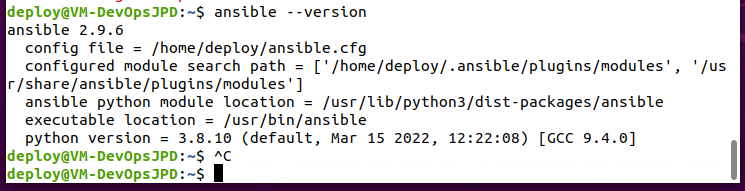
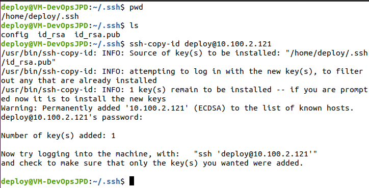
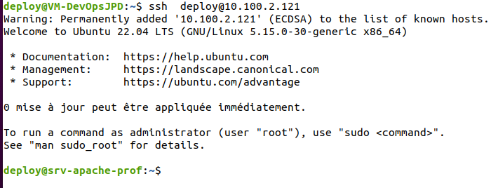
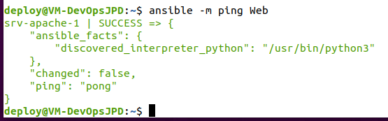
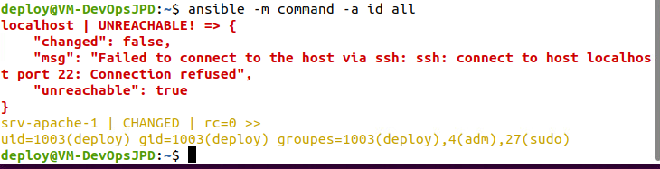

# Exercice 20 - Ansible  - Installation et configuration de base

- Environnement : vSphere
- Temps de réalisation : 4 heures

Dans cet exercice, nous allons installer Ansible sur votre machine virtuelle.

Voici ce qu'en dit la documentation sur Ansible :

"Ansible est un outil d'automatisation informatique. Il permet de configurer des systèmes, de déployer des logiciels et d'orchestrer des tâches informatiques plus avancées, telles que des déploiements continus ou des mises à jour permanentes sans temps d'arrêt."

"Les principaux objectifs d'Ansible sont la simplicité et la facilité d'utilisation. Il met également l'accent sur la sécurité et la fiabilité, avec un minimum de pièces mobiles, l'utilisation d'OpenSSH pour le transport (avec d'autres transports et modes d'extraction comme alternatives), et un langage qui est conçu autour de l'auditabilité par les humains - même ceux qui ne sont pas familiers avec le programme."

## Environnement de travail 

Nous aurons besoin de deux VMs, votre Ubuntu client déjà utilisé dans les cours précédents. Appellé ici station de gestion et une machine supplémentaire que nous appellerons srv-apache-[matricule]. Cette dernière représente une machine qui servira pour réaliser les différents tests. 

Dans cette exercice, nous allons travailler essentiellement sur la station de gestion.


## Protocole SSH 
Ansible est principalement conçu pour gérer des machines à l’aide du protocole SSH ou via des commandes lancées en local. Il est également possible de gérer d’autres types de machines, comme des systèmes Windows, des conteneurs Docker ou encore via des mécanismes d’isolation (chroot ou jail).

Même s’il est possible de passer par des mots de passe pour se connecter aux machines Linux, il est fortement recommandé de passer par des clés SSH. La suite sera consacrée à la génération des clés SSH. Dans l'exerice suivant vous allez procéder à leur propagation sur les machines à administrer.

### Génération de la clé 


Les connexions SSH se feront avec l’utilisateur *deploy*. Il faut donc créer cet utilisateur sur la station de gestion, créer sa clé et échanger la clé sur les noeuds que nous voulons gérer, dans notre cas srv-apache-matricule

Il est important d'utiliser un usager différent de votre usager de travail habituelle. Ce nouvelle usager doit pouvoir avoir les droits sudo pour exécuté les commandes sur la machine de contrôle mais il devra également exister sur chacun des noeuds gérés.


```bash
 sudo adduser deploy # Création rapide de l'usager
 sudo usermod -aG adm,sudo  deploy  # ajouter au groupe adm et sudo
 su deploy # ce connecter avec l'usager
 cd # ce déplacer dans son répertoire 
 ```

La génération de la clé est déclenchée par la commande ssh-keygen. On peut lui passer les options suivantes :

- Le type de clé à générer (rsa ou dsa) avec -t [rsa|dsa|es].
L’emplacement où générer la clé avec -f <emplacement-clé>.

- Une passphrase (phrase secrète) pour protéger la clé avec l’option -N.

- Éventuellement la longueur de la clé (-b 2048 pour une clé de 2 048 bits).

Si vous ne passez pas de paramètres à la commande, ssh-keygen produira une clé RSA et la commande demandera les choses suivantes :
- l’emplacement de la clé (par défaut $HOME/.ssh/id_rsa) ;
- une passphrase et la confirmation de la passphrase.

Ci-dessous un exemple de création de la clé :




Pour travailler avec Ansible, il est important de comprendre comment fonctionne l’authentification par clé. Pour cela, la commande SSH procède à un certain nombre d’opérations :

- Vérification de la signature du serveur distant. Si ce dernier n’est pas connu, l’utilitaire ssh proposera de stocker la chaîne présentée par le serveur.

- Récupération des clés privées SSH présentes dans le répertoire .ssh (fichiers id_rsa ou id_dsa) de l’utilisateur et vérification des droits sur les fichiers.

- Présentation des clés aux serveurs distants. Si une clé correspond à une entrée dans le fichier ~/.ssh/authorized_keys distant, le serveur crée un challenge à résoudre par le client.
- Le client résout le challenge (c’est d’ailleurs à ce moment qu’il faut saisir la passphrase de la clé SSH si vous l'avez configurée) et le renvoie au serveur : l’utilisateur est authentifié.

Les étapes permettant de s’assurer que l’utilisateur est bien celui qu’il prétend être.

### Parc important de machines ou hébergement dans le cloud

Dans le cas de l’administration d’un parc important de machines (ou changeant souvent de clé SSH comme dans le cas de machines hébergées dans le cloud), il n’est pas faisable de maintenir la liste des signatures de machines distantes.

La désactivation de ce mécanisme sur le poste de gestion se fait à l’aide des options SSH suivantes :

- Désactivation de la vérification stricte des clés SSH des machines distantes 
    (StrictHostKeyChecking no).

- Stockage des signatures de machines dans le fichier /dev/null 
    (UserKnownHostsFile /dev/null).

Cette configuration se fait en alimentant le contenu du fichier ~/.ssh/config. Ci-dessous le contenu de ce fichier avec ces deux options :

```bash
StrictHostKeyChecking no 
UserKnownHostsFile /dev/null  
```


## Installation d'ansible sur la station de gestion :

L’installation d’Ansible peut se faire de plusieurs manières 
- par l’intermédiaire des packages du système d'exploitation utilisé ;
- à l’aide de l’outil pip de Python (éventuellement combiné avec virtualenv) ;
- par l’utilisation des archives contenant le code source d’Ansible ;
- ou enfin, en interprétant directement le code source en provenance de Git.

Nous allons opter pour les packages système : 
```bash
sudo apt intall ansible
```
Vérification de la version d’Ansible

```bash
ansible --version
```
Ci-dessous un exemple de sortie de cette commande (ici avec la version 2.9.6) :
```bash
ansible 2.9.6
  config file = /etc/ansible/ansible.cfg
  configured module search path = ['/home/deploy/.ansible/plugins/modules', '/usr/share/ansible/plugins/modules']
  ansible python module location = /usr/lib/python3/dist-packages/ansible
  executable location = /usr/bin/ansible
  python version = 3.8.10 (default, Mar 15 2022, 09:04:19) [GCC 9.4.0]
```

## Modifiez l'emplacement du fichier ansible.cfg.

Ansible utilisera le fichier de configuration situé dans /etc/ansible/ansible.cfg, sauf s'il y a un fichier ansible.cfg dans le répertoire courant. 


Pour que Ansible prennent en considération notre répertoire nous allons créer un fichier ansible.cfg à la racine du répertoire usager de deploy :

```bash
vi ./ansible.cfg
#contenu du fichier :
[defaults]
inventory   = ./inventaire
remote_user = deploy
log_path    = ./.traces_d_ansible
```
- Pour tester les modifications, appellez à nouveau la commande ansible version:

```bash
ansible --version
```

Voici le résultat anttendu : 




## Premiére utilisation 

La syntaxe de base d'Ansible est la suivante :
```
ansible [-m module] [-a arguments] cible
```
Exemple avec le module setup qui se connecte sur la machine et vas chercher tous les informations de configuration :

```bash
ansible -m setup localhost > localhost.setup 
# La sortie est très importante, alors nous l'envoyons dans un fichier qui sera écrit dans un format JSON.
```

## Création de la machine srv-apache

Utiliser le template suivant pour créer la seconde machine :

- Allez dans le dossier :
DFC DS -> VM DFC -> Modeles -> Production -> TPL_20210422_Ub2004Cli
- Sélectionnez le modèle de VM et cliquez sur le bouton droit de votre souris et sélectionnez Nouvelle VM à partir de ce modèle...
- Suivez les étapes 
    - Nom de la VM : srv-apache-[matricule]
    - Emplacement : DFC DS -> VM DFC -> E22_4393_420W44_ITV_JPD
    - Stockage : SAN-DFC
    
- Après votre connexion, changer les informations suivantes 

    - Nom de la machine (fichier /etc/hostname ) :srv-apache-1
    - Renseignez le fichier /etc/hosts pour qu'il prenne en considération la modification.

    - Créer un compte : deploy  avec le même mot de passe que sur votre machine de gestion
    - Membre des groupes sudo et admin


```bash
 sudo adduser deploy 
 sudo usermod -aG adm,sudo  deploy
```

- Autoriser le service ssh sur srv-apache-1

        sudo apt-get install openssh-server
        sudo systemctl enable ssh --now
        sudo systemctl start ssh

- Dans votre machine de gestion, ajouter à votre fichier /etc/hosts l'adresse ip et le nom de votre srv-apache-1.


## Échange de clé par mot de passe
Dans la suite de l’exercice, les connexions SSH se feront avec l’utilisateur deploy.  
Par la suite, la machine rec-apache-1 sera administrée par clé SSH et vous disposerez du mot de passe de l’utilisateur root. Par conséquent, l’échange de clé se fera avec l’outil ssh-copy-id suivi du nom de la machine. Cet outil a pour fonction de prendre la clé publique SSH pour la déposer automatiquement sur la machine distante dans le fichier ~/.ssh/authorized_keys.
Il est également possible de faire précéder le nom de l’utilisateur avec lequel se connecter en utilisant une arobase (‘@’). Ci-dessous un exemple d’échange de clé avec l’utilisateur de la machine rec-apache-1 :




La clé est maintenant en place. Comme le message vous y invite, il est maintenant possible de se connecter avec la commande ssh deploy@srv-apache-1 pour s’assurer que l’échange de clé s’est bien passé :



L’échange de clé est effectué, il est maintenant possible de réaliser les premiers tests avec Ansible. Mais avant tous il faut renseignier l'inventaire d'Ansible sur la machine de gestion.

# Modifier le fichier d'inventaire 

Ansible utilise un fichier d'inventaire appelé hosts qui contient des informations sur l'appareil utilisées par les playbooks Ansible. L'emplacement par défaut du fichier d'inventaire Ansible est /etc/ansible/hosts comme spécifié dans le fichier ansible.cfg par défaut dans le même répertoire /etc/ansible. Ces fichiers par défaut sont utilisés lorsque Ansible est exécuté globalement. Cependant, pour des raison de facilité et de sécurité, vous allez exécuter Ansible à partir du répertoire de l'usager deploy, créé prédédament,  qui est membre du groupe sudo.

Le fichier d'inventaire Ansible définit les périphériques et groupes d'appareils utilisés par le playbook Ansible. Le fichier peut être dans l'un des nombreux formats, y compris YAML et INI, en fonction de votre environnement Ansible. Le fichier d'inventaire peut répertorier les périphériques par adresse IP ou par nom de domaine complet (FQDN), et peut également inclure des paramètres spécifiques à l'hôte.


- Avec votre éditeur, créé un fichier d'inventaire avec les informations suivante :
```bash
vi ./inventaire

# Contenu du fichier

localhost # Station de gestion 

[Web]
srv-apache-1

```
Sauvergarder vos modification et sortez de l'éditeur


Pour tester l'inventaire , vous pouvez appeler la commande ansible avec les options suivantes :

- le module ping (-m ping) ;
- le fichier inventaire (-i srv-apache-1.inv) ;
- le groupe sur lequel vous souhaitez travailler (ici all pour désigner toutes les machines).
```bash
ansible -m ping Web
# Ping sur tous les membres du groupe Web
```

Si la communication se passe bien, vous devriez obtenir le message suivant :



Testons l'ensemble de l'inventaire (All) et pas seulement le groupe Web et ce avec un commande id, module command argument -a id :
```
ansible -m command -a id all
```
qui vas nous renvoyer les informations suivantes :



## Défis et remise: 

Expliquer pourquoi Ansible ne peux se connecter sur localhost. Est-t-il possible de changer ça 


Remettez sur LÉA votre réponse avec une capture de la commande :

```
ansible -m command -a id all
```

## Référence :

[Ansible - Gérez la configuration de vos serveurs et le déploiement de vos applications (2e édition) ](https://www.eni-training.com/portal/client/mediabook/home)

[Github-Ansible](https://github.com/EditionsENI/ansible)

[group discussion](https://groups.google.com/g/ansible-project)


