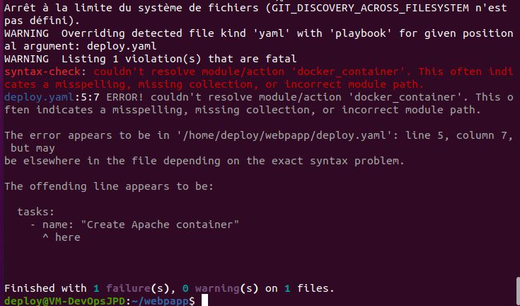
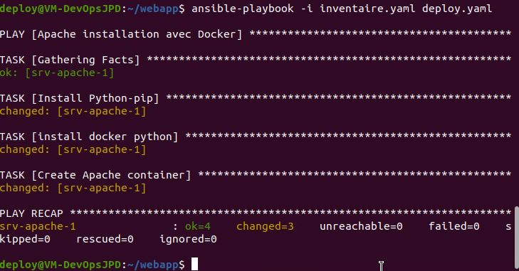
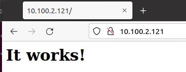
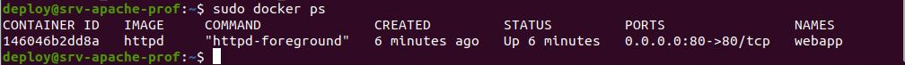

# Exercice 22 - Ansible  - Playbook

Dans cet exercice, vous allez utiliser Ansible sur des machines distantes avec des playbook.

 Voici les tâches à réaliser dans cet exercice :

  
  - Créer un dossier *webapp* qui va contenir tous les fichiers du projet.
  - Créer un dépôt git pour le projet et le placer sur GitHub.
  - Créer un fichier d'inventaire pour le projet 
  - Créer un groupe *prod* dans votre fichier d'inventaire. 
  - Créer un fichier group_vars qui va contenir un fichier nommé *prod* qui contiendra les informations de connexion à utiliser par Ansible (Login et mot de passe)
  - Créez un playbook nommé deloy.yaml permettant de déployer apache à l'aide de Docker sur le client (l'image à utiliser est httpd et le port à exposer à l'extérieur est le 80)
  - Vous devez installer tout le prérequis  à l'aide du module apt.
  - Vérifier la syntaxe du playbook avec la commande *ansible-lint* 
  - Vérifier qu'après l'exécution de votre playbook le site par défaut d’apache est bien disponible sur le port 80
  - Extraire le mot de passe.
  - Explorez les options de debug d’Ansible
  - Afin de conserver votre travail, poussez sur votre Github en mode privé. 
  - Ajouter le professeur à votre dépôt github.

## 1- Créer un dossier webapp qui va contenir tous les fichiers du projet.

```Bash
su deploy
cd
mkdir webapp
cd webapp/
```

## 2- Suive son code source sur GitHub
```bash
echo "# Webaap-ansible-apache" >>README.md
git config --global user.email "your@exemple.com" #si pas déjà définit.
git config --global user.user "Votre nom" #si pas déjà définit.
git init
git add *
git commit -m "Intialisation de mon dépôt"
# Créez le projet sur Github.com avec votre navigateur
git remote add origin git@github.com:[votrecompte git hub]/webapp-assible-apache.git
git push -u origin master
```

Créez le projet sur Github.com, en ne mettant PAS de Readme. Il vaut mieux l’ajouter après, une fois que les fichiers ont été uploader, pour éviter tout conflit.

git remote add origin 

leLienCopié va désigner le répertoire distant comme cible du projet.


## 3- Créer un fichier inventaire.yaml 

Créer un fichier inventaire.yaml pour le projet webapp.yaml avec un groupe prod : 

```yaml
---
all:
  vars:
    ansible_ssh_common_args: '-o StrictHostKeyChecking=no'
prod:
  hosts:
    client:
       ansible_host: 10.0.1.4 # A remplacer par l'IP de votre client
```

Remarquez l'instruction ansible_host. Elle vous permet d'utiliser Ansible pour la résolution de nom plutôt que votre fichier  /etc/hosts.


## 4- Création des group_vars:
Créer un répertoire group_vars qui va contenir un fichier nommé prod qui contiendra les informations de connexion à utiliser par Ansible (Login et mot de passe)

```Bash
mkdir group_vars
vi group_vars/prod.yaml
```
Contenus du fichier prod.yaml
```yaml
---
all: 
  ansible_user: deploy
  ansible_password: votreMotDePasse
```

## 5- Créez un playbook nommé deloy.yaml

Créez un playbook nommé dep---loy.yaml permettant de déployer Apache à l'aide de Docker sur le client (l'image à utiliser est httpd et le port à exposer à l'extérieur est le 80)
```Bash
vi deploy.yaml
```

```yaml
---
- name: "Apache installation avec Docker"
  hosts: prod
  tasks:
    - name: Create Apache container
      docker_container:
        name: webapp
        image: httpd
        ports:
            - "80:80"
```
## 6- Vérifier la syntaxe du playbook
Pour avoir l'outil de vérification de la syntaxe, nous aurons besoin d'ansible-lint qui s'installe avec l'installateur de package pour Python PIP. Voici les étapes :

```bash
sudo apt install python3-pip
sudo pip install ansible-lint
# Finalement, nous pouvons vérifier le fichier: 
ansible-lint deploy.yaml
```
Lorsqu'il n'y a pas d'erreur, exécutez le playbook

>[Attention]
  J'ai eu constamment une erreur. J'ai dû faire une nouvelle installation d’Ansible en allant chercher la version chez Ansible plutôt que celle d'Ubuntu. Voici les commandes :

<details>

```
sudo apt update
sudo apt install software-properties-common
sudo apt-add-repository --yes --update ppa:Ansible/Ansible
sudo apt install Ansible
```
</details>


## 7- Lancer le playbook
```
ansible-playbook -i inventaire.yaml deploy.yaml
```

Il devrait avoir une erreur d'absence du module python pour Docker:



On va ajouter le module manquant directement dans le playbook, c'est sa raison d'être après tout.

```yaml
---
- name: "Apache installation avec Docker"
  hosts: prod
  pre_task:
    - name: Install Docker python
      pip: 
        name=docker-py
  tasks:
    - name : Create Apache container
      docker_container:
        name: webapp
        image: httpd
        ports:
            - "80:80"
```
Exécution de playbook

```
ansible-playbook -i hosts.yaml deploy.yaml
```
Ne connais pas PIP 
On va installer PIP dans le playbook :

```yaml
---
- name: Apache installation avec Docker
  hosts: prod
  pre_task:
    - name: Install python-pip
      apt: 
        name: python3-pip 
        state: present 
    - name: Install Docker python
      pip: 
        name: Docker-py
  tasks:
    - name : Create Apache container
      docker_container:
        name: webapp
        image: httpd
        ports:
            - "80:80"
```
Exécution de playbook

```
ansible-playbook -i hosts.yaml deploy.yaml
```

Nouvelle erreur: Permision  denied

Nous n'avons pas les droits. Le compte deploy n'est pas suffisant. Il faut une élévation de privilège. Avec l'ajout de become: true

```yaml
---
- name: Apache installation avec Docker
  hosts: prod
  become: true  
  pre_task:
    - name: Install python-pip
      apt: 
        name: python3-pip 
        state: present 
    - name: Install Docker python
      pip: 
        name: Docker-py
  tasks:
    - name : Create Apache container
      docker_container:
        name: webapp
        image: httpd
        ports:
            - "80:80"
```
Exécution de playbook

```
ansible-playbook -i hosts.yaml deploy.yaml
```
Cette fois, "sudo: il est nécessaire de sais un mot de passe". 
Nous allons y aller pour la façon la plus  simple bien sure, la moins sûr :

```yaml
---
- name: "Apache installation avec Docker"
  hosts: prod
  become: true
  vars:
    ansible_sudo_pass: MotDePasse
  pre_task:
    - name: Install EPEP repo
      package: name=epel-release state=present
      when: ansible_distribution == "CentOS" # Ici ajout d'une condition
    - name: Install python-pip
      apt: 
        name=pyton3-pip 
        state=present 
        update_cache=yes
    - name: Install Docker python
      pip: name=docker-py
  tasks:
    - name : Create Apache container
      docker_container:
        name: webapp
        image: httpd
        ports:
            - "80:80"
```
Exécution de playbook

```
ansible-playbook -i hosts.yaml deploy.yaml
```

Résultat attendu : 



Vérifions dans le navigateur :




Et aussi sur la machine srv-apache-1 : 




## 8- Sortir le mot de passe d playbook

```bash
vi ansible.cfg
# Ajoutons le paramètre nécessaire:
[privilege_escalation]
become_ask_pass=true
```
Exécution de playbook

```
ansible-playbook -i hosts.yaml deploy.yaml
```

Le mot de passe est demandé.


# Remise

Placer des captures des commandes suivantes dans un seul fichier et déposer le sur LÉA dans travaux exercice 22. 

>[!Astuce] Utiser un terminal pour les deux commande cat et un autres pour l'éxécution de playbook et ce, côte à côte.

```bash
cat hosts.yaml
cat deploy.yaml
ansible-playbook -i hosts.yaml deploy.yaml
```
