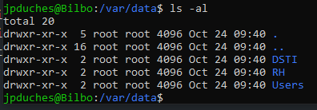

# Exercice 6 - Administration système : gestion d'usager


- Évaluation : formative
- Durée estimée : 1 heure
- Système d'exploitation : Ubuntu Client et serveur

**Objectifs :**

- Effectuer des tâches de gestion du système d’exploitation.
- Création correcte des comptes et des groupes d’utilisateurs.
- Attribution correcte des droits d’accès.

## Création d'usagers

- Connectez-vous à votre serveur depuis votre station de travail.

- Vérifier la présence du groupe suivant, s'il n'est pas présent, créer le :


|Groupe | Membres |
|----------     | ----------    |
| users | tous les usagers du système |

```bash
cat /etc/group | grep users
```

- Créez les usagers du tableau suivant 
- Pour les login respectez la nomenclature première lettre du prénom et le nom. 
- ATTENTION : Tous ces utilisateurs doivent être membre du groupe  **users** vérifier avec le man useradd pour savoir comment y parvenir.
- Vérifier la présence du shell avant de l'ajouter à la commande.


|Nom            | Répertoire    | Mot de passe  | Interpréteur de commande |
|----------     | ----------    | ------------- |------------- |
| Éric Bédard   | /home/ebedard | S0l&il01      |/bin/bash
| Joanie Slyte  | /home/jslyte  | S0l&il01      |/bin/bash
| Raja Ayadi    | /home/rayadi  | S0l&il01      |/bin/sh
| Usager1       | aucun     | aucun     | aucun  |


Exemple de création : 
```bash
$sudo adduser ebedard
```
- Créer ou utiliser les groupes suivants et  ajouter les bons usagers aux membres des groupes  :


|Groupe | Membres |
|----------     | ----------    |
| users | tous les usagers du système |
| admin | Vous et Raja Ayadi |
| cdrom | tous les usagers du système |
| rh | Eric Bédard et Joanie Slyte |


- Modifier les mots de passe des utilisateurs **ebedard** et **jslyte** pour "Pa$$ord01"


## Création d’une structure de fichiers


- Créez la structure suivante sur le serveur : 





- Modifiez les attributs de ces répertoires de la manière suivante :


1- DSTI :
   * Propriétaire : root 
   * Accessible en lecture, écriture et exécution pour le propriétaire
   * Accessible en lecture, écriture et exécution pour le groupe admin
   * Pas accessible pour les autres


2- RH :
   * Propriétaire : root 
   * Accessible en lecture, écriture et exécution pour le propriétaire
   * Accessible en lecture, écriture  pour le groupe rh
   * Pas accessible pour les autres


3- Users :
   * Propriétaire : root 
   * Groupe : users
   * Accessible en lecture, écriture et exécution pour le propriétaire
   * Placer un sticky bit sur le répertoire

## Utilisation de liens symboliques

- Pour tous les usagers, sauf root, créer un lien symbolique dans son répertoire personnel vers /var/data.
- La commande doit être faite à partir de votre usager principal sans avoir a vous déplacer dans l'arborescence.
- Connecter-vous avec l'un des usagers pour vérifier le fonctionnement du lien symbolique.
## Pour vérification
Remettre une capture d’écran des commandes suivantes, et dans un seul fichier dans l'espace travaux, exercice 6 sur LÉA.

```bash
tail /etc/passwd
tail /etc/group
ls -l /var/data
```


