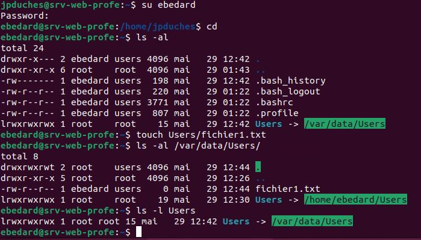

# Exercice 6 - Administration système : gestion d'usager


- Évaluation : formative
- Durée estimée : 1 heure
- Système d'exploitation : Ubuntu 20.04 Lts Client et serveur


**Objectifs :**


- Effectuer des tâches de gestion du système d’exploitation.
- Création correcte des comptes et des groupes d’utilisateurs.
- Attribution correcte des droits d’accès.


# Corrigé :

## Remarquer que je suis toujours dans mon répertoire d'usager pour travailler.
```bash
# Vérifier si le groupe users existe :
cat /etc/group | grep users

# Vérifier la présence des shells :
ls -l /bin/bash
ls -l /bin/sh

# Création des usagers selon le tableau :
sudo adduser --ingroup users ebedard
# Saisir le nouveau mot de passe 2 fois
S0l&il01
   FullName [] : Éric Bédard
   #pour les autres options, laisser vide en appuyant Entrée.
   Finalement Y pour finir
# Même chose pour le suivant :
sudo adduser --ingroup users jslyte

# Différent au niveau du shell pour rayadi
sudo adduser --ingroup users --shell /bin/sh rayadi

# Le dernier :
sudo adduser --system --no-create-home  user1

# Pour vérifier votre travail : 
tail /etc/passwd
tail /etc/group
ls -l /home
```

- Ajouter les groupes :

```bash
sudo addgroup admin
sudo addgroup rh
```
- Ajouter les membres des groupes :

```bash
sudo usermod -a -G admin [vous]
sudo usermod -a -G admin rayadi 
sudo usermod -a -G cdrom [vous ]
sudo usermod -a -G cdrom ebedard 
sudo usermod -a -G cdrom jslyte 
sudo usermod -a -G cdrom rayadi 
sudo usermod -a -G rh ebedard
sudo usermod -a -G rh jslyte  
# Les usagers sont déjà membre du groupe users
```
 Pour vérifier votre travail : 

```bash
cat /etc/group | grep admin
cat /etc/group | grep cdrom
cat /etc/group | grep rh
```
- Modifier les mots de passe  **ebedard** et **jslyte** pour "Pa$$ord01":

```bash
sudo passwd ebedard
   # Tapez le nouveau mot de passe 2 fois. 
sudo passwd jslyte 
   # Tapez le nouveau mot de passe 2 fois.
```
- Création d’une structure de fichiers

```bash
sudo mkdir /var/data
sudo mkdir /var/data/DSTI
sudo mkdir /var/data/RH
sudo mkdir /var/data/Users
```
- Modification des droits :
```bash
sudo chmod 755 /var/data
sudo chmod 770 /var/data/DSTI
sudo chmod 760 /var/data/RH
sudo chmod 1777 /var/data/Users
sudo chgrp admin /var/data/DSTI
sudo chgrp rh /var/data/RH
sudo chgrp users /var/data/Users
```
- Utilisation de liens symboliques

```bash
sudo ln -s /var/data/Users /home/ebedard/Users 
sudo ln -s /var/data/Users /home/jslyte/Users 
sudo ln -s /var/data/Users /home/rayadi/Users 

# Vérification du lien
su ebedard
#Entrez son mot de passe Pa$$ord01
cd
pwd
ls -al
touch Users/fichier1.txt
# Vérifier le fichier dans :
ls -al /var/data/Users
```
Résultat attendu :


Remise : 

```bash
tail /etc/passwd
tail /etc/group
ls -l /var/data
```
<details>