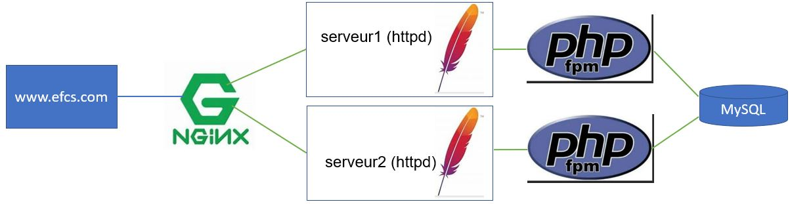

# TP3 et EFCS (partie pratique)
# Déploiement dans un environnement avec Ansible

## Informations
- Évaluation : 25 % de la session
- Type de travail : individuel
- Date de remise : 9 octobre 2022
- Durée : 10 heures, dont 2 séances (29 septembre et 5 octobre). 
- Système d’exploitation : Linux Ubuntu / Docker
- Environnement : Docker

## Énoncé
Le but de cette épreuve à caractère synthèse a pour objectifs :
-	Faire une installation complète d’un site Web avec équilibrage de charge.
-	Utiliser Nginx comme un équilibreur/répartiteur de charge (load balancer).
-	Utiliser Apache (httpd) comme serveur de contenus.
- Utiliser php-fpm comme fastCgi.
- Utiliser MySQL comme serveur de base de données.
- Le tout automatisé avec Ansible.

## Description de l'infrastructure

Nginx est utilisé comme équilibreur de charge pour avoir une structure comme celle-ci :

Donc, on se connecte sur www.efcs.com qui appelle le proxy nginx qui lui appelle en en alternance les serveurs 1 et 2. Chacun des serveurs est relié à un serveur php et à un serveur MySQL. 
-	Les deux serveurs web doivent être identiques, à part une information, dans la page Web, qui permet de distinguer le serveur 1 et le serveur 2, adresse Ip et Nom. 
-	Les serveurs httpd et le serveur proxy seront reliés à un réseau avant.
-	Les serveurs httpd auront chacun leur réseau arrière pour communiquer avec leurs serveurs php.
-	Le contenu des serveurs httpd doit être monté par un point de montage à un répertoire de votre VM.
-	Le serveur MYSQL doit avoir un volume de données persistant.

-	Vous devrez démontrer le système fonctionnel.
Attention : ne mettez pas de dépendance aux serveurs httpd.

## Ansible 

### Un fichier d'inventaire en format YAML doit contenir :

  - Tous les hôtes via le groupe "all" devront avoir pour login admin.
  - Les clients devront faire partie d'un groupe appeler "prod"
  - Le mot de passe à utiliser pour toutes les connexions ssh devra être admin  pour toutes les machines du groupe "prod".
  - La variable "env" devra être égale à "production" pour toutes les machines du group "prod".
  - Vous devez avoir 
    - production 
    - staging
    - group_vars/
    - host_vars/
### Vous devez avoir des playbook pour :

- LoadBalanceur
- Web
- bd

### Votre déploiement :
  - Se fait avec une seule commande et reproduit toute l'architecture.

## Remise 
Vous devez fournir (déposé sur LÉA) :

- L'adresse de votre dépôt GitHub dans un fichier texte.

Vous devez fournir (déposé sur GitHub) :
  - Un dépôt privé avec votre code source du TP3.
  - Tous les fichiers de votre travail à l'exception de la vidéo.
  - Je dois trouver l'adresse de votre vidéo dans le fichier readme.md de votre projet.

Votre vidéo :
  - Une vidéo d'environ 8 min. (maximum 10 min.):
  -   Explication de tous vos fichiers
  -   Démonstration que le site fonctionne avec les deux serveurs

## Évaluation :
|Item ||Points  |
--- | --- | --- |
|LoadBalancer ||
||Définition des 2 serveurs|5|
||Contexte serveur|5|
|Serveur1/Serveur2 ||
||httpd|5
||php|5
||Lien entre php et MySQL |5
||Page Web d'identification |5
|Commandes ||
||Ansible|40|
||Voir les logs |10|
|Compréhension||10|
|**Total** ||**100**|