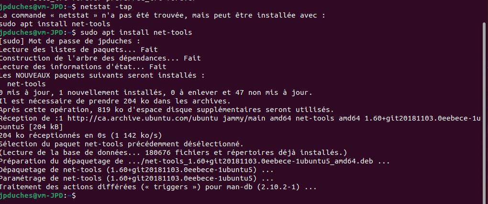

# Cours 3 : 24 mai 2022

## État de la situation exercice 2 et 3 ?

- Attention à l'emplacement des Vms
- Qu'elle est l'état de vos partitions dynamique ?

<details>  

```bash

/etc/fstab #informations statiques sur les systèmes de fichiers

```
</details>      


## Théorie 

## Exercice 4
## Exercice 3 Partie 4: Ajuster votre fichier /etc/fstab


Exercice 3 partie 

Attention si la commande n'est pas présente, il faut l'installer.

Exemple 




## Je dois pouvoir vous identifier sur la capture.
Exemple de capture acceptable client: 


Exemple de capture acceptable serveur: 


